# 🗺️ Entity Relationship Diagram (ERD)

## 📊 ERD - Aplikasi Belajar Bahasa Inggris

### Format 1: Mermaid Diagram (Dapat di-render di GitHub/GitLab)

```mermaid
erDiagram
    PERAN ||--o{ USERS : "has"
    USERS ||--o{ MATERI : "creates"
    USERS ||--o{ KUIS : "creates"
    USERS ||--o{ PERCOBAAN_KUIS : "attempts"
    MATERI ||--o{ KOSAKATA : "contains"
    MATERI ||--o{ KUIS : "relates to"
    KUIS ||--o{ SOAL_KUIS : "has"
    KUIS ||--o{ PERCOBAAN_KUIS : "attempted in"
    SOAL_KUIS ||--o{ PILIHAN_JAWABAN : "has"
    SOAL_KUIS ||--o{ JAWABAN_SISWA : "answered in"
    PILIHAN_JAWABAN ||--o{ JAWABAN_SISWA : "selected in"
    PERCOBAAN_KUIS ||--o{ JAWABAN_SISWA : "contains"

    PERAN {
        bigint id PK
        varchar nama_peran
        varchar deskripsi
        timestamp created_at
        timestamp updated_at
    }

    USERS {
        bigint id PK
        varchar name
        varchar email UK
        varchar password
        bigint peran_id FK
        varchar nomor_induk
        varchar kelas
        varchar kelas_mengajar
        text alamat
        varchar no_telepon
        enum jenis_kelamin
        date tanggal_lahir
        timestamp email_verified_at
        varchar remember_token
        timestamp created_at
        timestamp updated_at
    }

    MATERI {
        bigint id PK
        varchar judul
        enum jenis_materi
        text deskripsi
        text konten
        varchar video_url
        varchar video_path
        bigint dibuat_oleh FK
        varchar kelas_target
        int urutan
        boolean aktif
        timestamp created_at
        timestamp updated_at
    }

    KOSAKATA {
        bigint id PK
        bigint materi_id FK
        varchar kata_inggris
        varchar kata_indonesia
        varchar jenis_kata
        text contoh_kalimat
        varchar audio_path
        varchar gambar_path
        int urutan
        timestamp created_at
        timestamp updated_at
    }

    KUIS {
        bigint id PK
        varchar judul
        text deskripsi
        bigint materi_id FK
        int durasi_menit
        int nilai_minimal
        enum tingkat_kesulitan
        bigint dibuat_oleh FK
        varchar kelas_target
        boolean aktif
        boolean acak_soal
        boolean tampilkan_jawaban
        timestamp created_at
        timestamp updated_at
    }

    SOAL_KUIS {
        bigint id PK
        bigint kuis_id FK
        text pertanyaan
        enum jenis_soal
        varchar gambar_path
        varchar audio_path
        int poin
        int urutan
        timestamp created_at
        timestamp updated_at
    }

    PILIHAN_JAWABAN {
        bigint id PK
        bigint soal_id FK
        text teks_jawaban
        boolean jawaban_benar
        int urutan
        timestamp created_at
        timestamp updated_at
    }

    PERCOBAAN_KUIS {
        bigint id PK
        bigint kuis_id FK
        bigint siswa_id FK
        timestamp waktu_mulai
        timestamp waktu_selesai
        int nilai
        int jumlah_benar
        int jumlah_salah
        int total_soal
        enum status
        boolean lulus
        timestamp created_at
        timestamp updated_at
    }

    JAWABAN_SISWA {
        bigint id PK
        bigint percobaan_id FK
        bigint soal_id FK
        bigint pilihan_jawaban_id FK
        text jawaban_isian
        boolean benar
        int poin_didapat
        timestamp created_at
        timestamp updated_at
    }
```



---

### Format 2: ASCII Art ERD (Detailed)

```
┌─────────────────────────────────────────────────────────────────────────────┐
│                          SISTEM BELAJAR BAHASA INGGRIS                      │
│                                    ERD v1.3.2                               │
└─────────────────────────────────────────────────────────────────────────────┘

┌──────────────────┐
│      PERAN       │
├──────────────────┤
│ PK  id           │
│     nama_peran   │◄────────────┐
│     deskripsi    │             │
│     timestamps   │             │ 1:N
└──────────────────┘             │
                                 │
┌────────────────────────────────┴─────────────────────────────────────────┐
│                              USERS                                       │
├──────────────────────────────────────────────────────────────────────────┤
│ PK  id                                                                   │
│     name                                                                 │
│ UK  email                                                                │
│     password                                                             │
│ FK  peran_id ────────────────────────────────────────────────────────────┘
│     nomor_induk (NIP/NIS)                                                │
│     kelas (7/8 untuk siswa)                                              │
│     kelas_mengajar (7/8 untuk guru)                                      │
│     alamat, no_telepon, jenis_kelamin, tanggal_lahir                     │
│     email_verified_at, remember_token                                    │
│     timestamps                                                           │
└──────────────────────────────────────────────────────────────────────────┘
         │                                    │
         │ 1:N (guru creates)                 │ 1:N (siswa attempts)
         │                                    │
         ▼                                    ▼
┌─────────────────────────────┐    ┌─────────────────────────────┐
│          MATERI             │    │     PERCOBAAN_KUIS          │
├─────────────────────────────┤    ├─────────────────────────────┤
│ PK  id                      │    │ PK  id                      │
│     judul                   │    │ FK  kuis_id                 │
│     jenis_materi            │    │ FK  siswa_id ───────────────┘
│     deskripsi               │    │     waktu_mulai             │
│     konten                  │    │     waktu_selesai           │
│     video_url, video_path   │    │     nilai                   │
│ FK  dibuat_oleh ────────────┘    │     jumlah_benar            │
│     kelas_target (7/8)      │    │     jumlah_salah            │
│     urutan, aktif           │    │     total_soal              │
│     timestamps              │    │     status                  │
└─────────────────────────────┘    │     lulus                   │
         │                          │     timestamps              │
         │ 1:N                      └─────────────────────────────┘
         │                                    │
         ▼                                    │ 1:N
┌─────────────────────────────┐              │
│         KOSAKATA            │              ▼
├─────────────────────────────┤    ┌─────────────────────────────┐
│ PK  id                      │    │      JAWABAN_SISWA          │
│ FK  materi_id ──────────────┘    ├─────────────────────────────┤
│     kata_inggris            │    │ PK  id                      │
│     kata_indonesia          │    │ FK  percobaan_id ───────────┘
│     jenis_kata              │    │ FK  soal_id                 │
│     contoh_kalimat          │    │ FK  pilihan_jawaban_id      │
│     audio_path              │    │     jawaban_isian           │
│     gambar_path             │    │     benar                   │
│     urutan                  │    │     poin_didapat            │
│     timestamps              │    │     timestamps              │
└─────────────────────────────┘    └─────────────────────────────┘
                                             ▲         ▲
                                             │         │
                                             │ N:1     │ N:1
         ┌───────────────────────────────────┘         │
         │                                             │
┌────────┴──────────────────┐    ┌────────────────────┴─────────┐
│         KUIS              │    │     PILIHAN_JAWABAN          │
├───────────────────────────┤    ├──────────────────────────────┤
│ PK  id                    │    │ PK  id                       │
│     judul                 │    │ FK  soal_id ─────────────────┘
│     deskripsi             │    │     teks_jawaban             │
│ FK  materi_id (optional)  │    │     jawaban_benar            │
│     durasi_menit          │    │     urutan                   │
│     nilai_minimal         │    │     timestamps               │
│     tingkat_kesulitan     │    └──────────────────────────────┘
│ FK  dibuat_oleh           │              ▲
│     kelas_target (7/8)    │              │ 1:N
│     aktif                 │              │
│     acak_soal             │    ┌─────────┴────────────────────┐
│     tampilkan_jawaban     │    │       SOAL_KUIS              │
│     timestamps            │    ├──────────────────────────────┤
└───────────────────────────┘    │ PK  id                       │
         │                       │ FK  kuis_id ─────────────────┘
         │ 1:N                   │     pertanyaan               │
         └───────────────────────►│     jenis_soal               │
                                 │     gambar_path              │
                                 │     audio_path               │
                                 │     poin                     │
                                 │     urutan                   │
                                 │     timestamps               │
                                 └──────────────────────────────┘

LEGEND:
PK  = Primary Key
FK  = Foreign Key
UK  = Unique Key
1:N = One to Many Relationship
N:1 = Many to One Relationship
```

---

### Format 3: Simplified ERD (Core Relationships)

```
                    ┌─────────┐
                    │  PERAN  │
                    └────┬────┘
                         │ 1:N
                    ┌────▼────┐
                    │  USERS  │
                    └────┬────┘
                         │
            ┌────────────┼────────────┐
            │ 1:N        │ 1:N        │ 1:N
            │            │            │
       ┌────▼────┐  ┌───▼────┐  ┌────▼──────────┐
       │ MATERI  │  │  KUIS  │  │ PERCOBAAN_KUIS│
       └────┬────┘  └───┬────┘  └────┬──────────┘
            │           │            │
            │ 1:N       │ 1:N        │ 1:N
            │           │            │
       ┌────▼────┐  ┌───▼────────┐  │
       │KOSAKATA │  │ SOAL_KUIS  │  │
       └─────────┘  └───┬────────┘  │
                        │            │
                        │ 1:N        │
                        │            │
                   ┌────▼────────┐   │
                   │  PILIHAN_   │   │
                   │  JAWABAN    │   │
                   └────┬────────┘   │
                        │            │
                        └────┬───────┘
                             │ N:1
                        ┌────▼────────┐
                        │  JAWABAN_   │
                        │   SISWA     │
                        └─────────────┘
```

---

### Format 4: Crow's Foot Notation

```
PERAN ||--o{ USERS : "has role"
    id (PK)
    nama_peran
    deskripsi

USERS ||--o{ MATERI : "creates"
USERS ||--o{ KUIS : "creates"
USERS ||--o{ PERCOBAAN_KUIS : "attempts"
    id (PK)
    email (UK)
    peran_id (FK)
    kelas
    kelas_mengajar

MATERI ||--o{ KOSAKATA : "contains"
MATERI ||--o{ KUIS : "relates to"
    id (PK)
    dibuat_oleh (FK)
    kelas_target

KOSAKATA }o--|| MATERI : "belongs to"
    id (PK)
    materi_id (FK)

KUIS ||--o{ SOAL_KUIS : "has questions"
KUIS ||--o{ PERCOBAAN_KUIS : "attempted in"
    id (PK)
    materi_id (FK)
    dibuat_oleh (FK)
    kelas_target

SOAL_KUIS ||--o{ PILIHAN_JAWABAN : "has choices"
SOAL_KUIS ||--o{ JAWABAN_SISWA : "answered in"
    id (PK)
    kuis_id (FK)

PILIHAN_JAWABAN }o--|| SOAL_KUIS : "belongs to"
PILIHAN_JAWABAN ||--o{ JAWABAN_SISWA : "selected in"
    id (PK)
    soal_id (FK)

PERCOBAAN_KUIS }o--|| KUIS : "attempt of"
PERCOBAAN_KUIS }o--|| USERS : "attempted by"
PERCOBAAN_KUIS ||--o{ JAWABAN_SISWA : "contains"
    id (PK)
    kuis_id (FK)
    siswa_id (FK)

JAWABAN_SISWA }o--|| PERCOBAAN_KUIS : "part of"
JAWABAN_SISWA }o--|| SOAL_KUIS : "answers"
JAWABAN_SISWA }o--o| PILIHAN_JAWABAN : "selects"
    id (PK)
    percobaan_id (FK)
    soal_id (FK)
    pilihan_jawaban_id (FK)
```

---

### Format 5: Table Relationship Matrix

| From Table | To Table | Relationship | Cardinality | FK Column | ON DELETE |
|------------|----------|--------------|-------------|-----------|-----------|
| peran | users | has | 1:N | peran_id | CASCADE |
| users (guru) | materi | creates | 1:N | dibuat_oleh | CASCADE |
| users (guru) | kuis | creates | 1:N | dibuat_oleh | CASCADE |
| users (siswa) | percobaan_kuis | attempts | 1:N | siswa_id | CASCADE |
| materi | kosakata | contains | 1:N | materi_id | CASCADE |
| materi | kuis | relates to | 1:N | materi_id | SET NULL |
| kuis | soal_kuis | has | 1:N | kuis_id | CASCADE |
| kuis | percobaan_kuis | attempted in | 1:N | kuis_id | CASCADE |
| soal_kuis | pilihan_jawaban | has | 1:N | soal_id | CASCADE |
| soal_kuis | jawaban_siswa | answered in | 1:N | soal_id | CASCADE |
| pilihan_jawaban | jawaban_siswa | selected in | 1:N | pilihan_jawaban_id | SET NULL |
| percobaan_kuis | jawaban_siswa | contains | 1:N | percobaan_id | CASCADE |

---

### Format 6: Data Flow Diagram

```
┌─────────────────────────────────────────────────────────────────┐
│                        USER FLOW                                │
└─────────────────────────────────────────────────────────────────┘

SUPER ADMIN:
    ┌──────────┐
    │  LOGIN   │
    └────┬─────┘
         │
    ┌────▼─────────────────────────┐
    │  Manage USERS (Guru/Siswa)   │
    └──────────────────────────────┘

GURU:
    ┌──────────┐
    │  LOGIN   │
    └────┬─────┘
         │
    ┌────▼─────────────────────────┐
    │  Create/Edit MATERI          │
    │  - Grammar (konten + video)  │
    │  - Vocabulary (+ kosakata)   │
    └────┬─────────────────────────┘
         │
    ┌────▼─────────────────────────┐
    │  Create/Edit KUIS            │
    │  - Add SOAL_KUIS             │
    │  - Add PILIHAN_JAWABAN       │
    └────┬─────────────────────────┘
         │
    ┌────▼─────────────────────────┐
    │  View PERCOBAAN_KUIS         │
    │  - See student results       │
    │  - View JAWABAN_SISWA        │
    └──────────────────────────────┘

SISWA:
    ┌──────────┐
    │  LOGIN   │
    └────┬─────┘
         │
    ┌────▼─────────────────────────┐
    │  View MATERI (by kelas)      │
    │  - Read Grammar              │
    │  - Study Vocabulary          │
    └────┬─────────────────────────┘
         │
    ┌────▼─────────────────────────┐
    │  Take KUIS (by kelas)        │
    │  - Create PERCOBAAN_KUIS     │
    │  - Answer SOAL_KUIS          │
    │  - Create JAWABAN_SISWA      │
    └────┬─────────────────────────┘
         │
    ┌────▼─────────────────────────┐
    │  View Results                │
    │  - See PERCOBAAN_KUIS        │
    │  - Review JAWABAN_SISWA      │
    └──────────────────────────────┘
```

---

### Format 7: Class Isolation Diagram

```
┌─────────────────────────────────────────────────────────────────┐
│                    CLASS ISOLATION SYSTEM                       │
└─────────────────────────────────────────────────────────────────┘

                    ┌──────────────┐
                    │ SUPER ADMIN  │
                    │ (No Filter)  │
                    └──────┬───────┘
                           │
                ┌──────────┴──────────┐
                │                     │
         ┌──────▼──────┐       ┌─────▼──────┐
         │ GURU KELAS 7│       │GURU KELAS 8│
         │kelas_mengajar=7│    │kelas_mengajar=8│
         └──────┬──────┘       └─────┬──────┘
                │                     │
         ┌──────▼──────┐       ┌─────▼──────┐
         │MATERI KELAS 7│      │MATERI KELAS 8│
         │kelas_target=7│      │kelas_target=8│
         └──────┬──────┘       └─────┬──────┘
                │                     │
         ┌──────▼──────┐       ┌─────▼──────┐
         │ KUIS KELAS 7│       │ KUIS KELAS 8│
         │kelas_target=7│      │kelas_target=8│
         └──────┬──────┘       └─────┬──────┘
                │                     │
         ┌──────▼──────┐       ┌─────▼──────┐
         │SISWA KELAS 7│       │SISWA KELAS 8│
         │  kelas=7    │       │  kelas=8    │
         └─────────────┘       └─────────────┘

ISOLATION RULES:
✓ Guru kelas 7 → Only see/manage kelas_target=7
✓ Guru kelas 8 → Only see/manage kelas_target=8
✓ Siswa kelas 7 → Only see kelas_target=7
✓ Siswa kelas 8 → Only see kelas_target=8
✓ Super Admin → See all data (no filter)
```

---

### Format 8: Database Statistics (After Seeding)

```
┌─────────────────────────────────────────────────────────────────┐
│                    DATABASE STATISTICS                          │
└─────────────────────────────────────────────────────────────────┘

TABLE: peran
├── Total: 3 records
└── Values: super_admin, guru, siswa

TABLE: users
├── Total: 17 records
├── Super Admin: 3
├── Guru: 4 (2 kelas 7, 2 kelas 8)
└── Siswa: 10 (5 kelas 7, 5 kelas 8)

TABLE: materi
├── Total: 10 records
├── Kelas 7: 6 (3 grammar, 3 vocabulary)
└── Kelas 8: 4 (2 grammar, 2 vocabulary)

TABLE: kosakata
├── Total: 50 records
├── Kelas 7: 30 (10 per vocabulary)
└── Kelas 8: 20 (10 per vocabulary)

TABLE: kuis
├── Total: 7 records
├── Kelas 7: 4 (mudah: 3, sedang: 1)
└── Kelas 8: 3 (sedang: 2, sulit: 1)

TABLE: soal_kuis
├── Total: 19 records
├── Kelas 7: 13 soal
└── Kelas 8: 6 soal

TABLE: pilihan_jawaban
├── Total: 70 records
├── Kelas 7: 48 pilihan
└── Kelas 8: 22 pilihan

TABLE: percobaan_kuis
├── Total: 26 records
├── Status Selesai: 24
├── Status Sedang Dikerjakan: 1
└── Status Waktu Habis: 1

TABLE: jawaban_siswa
├── Total: 96 records
├── Jawaban Benar: ~60
└── Jawaban Salah: ~36
```

---

## 📝 Notes

### Cardinality Symbols
- `||` = Exactly one
- `|o` = Zero or one
- `}o` = Zero or many
- `}|` = One or many

### Relationship Types
- **1:1** = One to One
- **1:N** = One to Many
- **N:1** = Many to One
- **N:M** = Many to Many (through junction table)

### Foreign Key Actions
- **CASCADE** = Delete child when parent deleted
- **SET NULL** = Set FK to NULL when parent deleted
- **RESTRICT** = Prevent deletion if child exists

---

**Created**: 2025-11-20  
**Version**: 1.3.2  
**Database**: MySQL/MariaDB  
**Total Tables**: 14 (9 main + 5 system)
